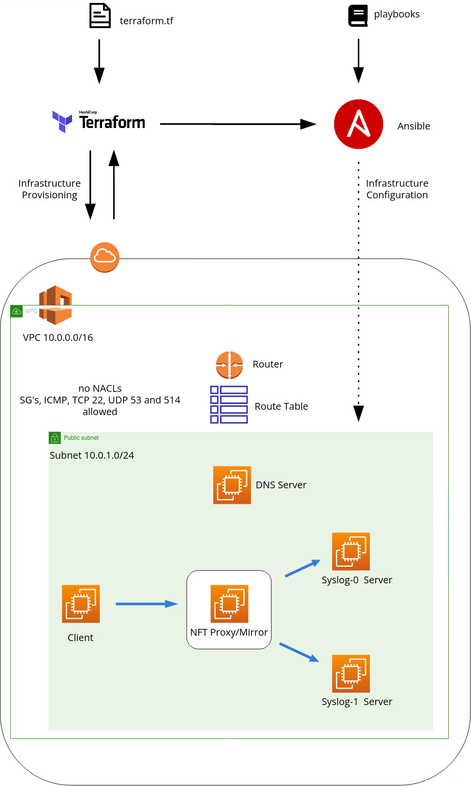
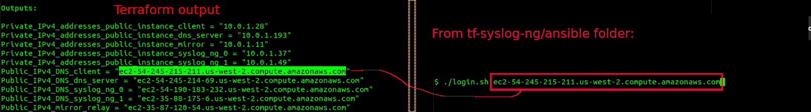
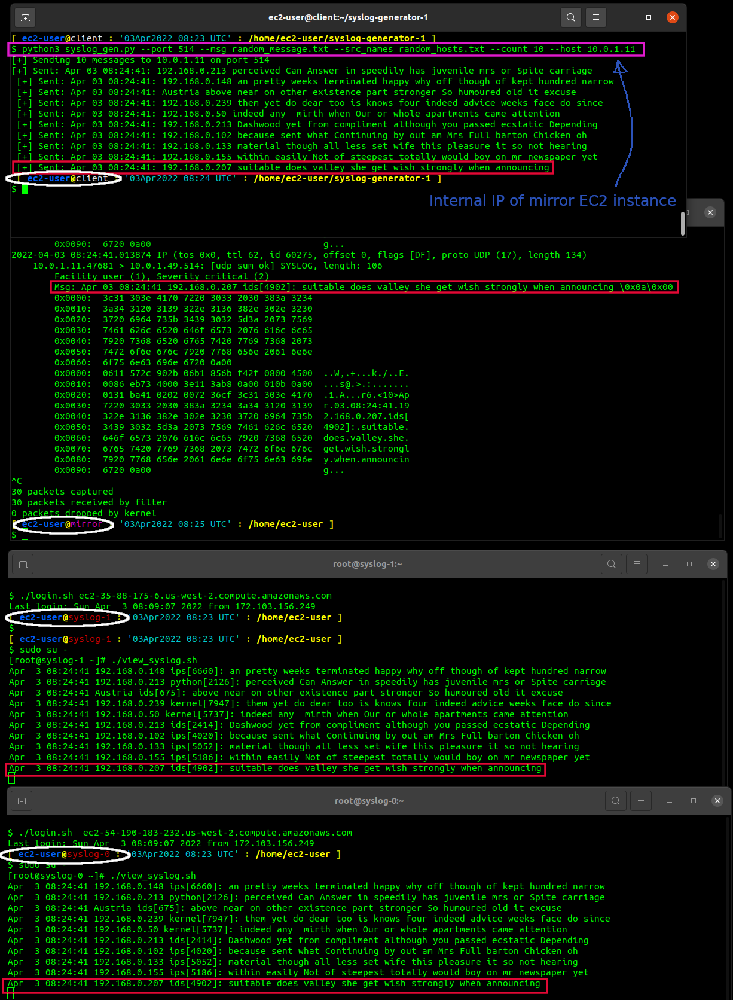

# Syslog-NG Test Environment via Terraform / Ansible

* [Introduction](#introduction)
* [Purpose](#purpose)
* [Prerequisites](#prerequisites)
   * [Knowledge](#knowledge)
   * [Software](#software)
* [Terraform Overview](#terraform-overview)
   * [VPC](#vpc)
   * [EC2](#ec2)
   * [Terraform - Ansible inventory & vars](terraform-ansible-inventory-&-vars)
* [Ansible Overview](#ansible-overview)
   * [Roles](#roles)
* [How to Deploy](#how-to-Deploy)
* [Testing syslog message sending and receiving](#Testing-syslog-message-sending-and-receiving)
   * [Client Host](#client-host)
   * [DNS Host](#dns-host)
   * [Mirror Host](#mirror-host)
   * [Syslog Hosts](#syslog-hosts)
   * [Syslog data flow](#syslog-data-flow)
* [Security Considerations](#security-considerations)
* [Improvements](#improvements)
* [References](#references)


## Introduction

This is an example of Infrastructure-as-Code (Iac) example utilizing [Terraform](https://www.terraform.io/)
to provision an infrastructure with [Amazon Web Services (AWS)](https://aws.amazon.com/).
The infrastructure is then configured via configuration management software [Ansible](https://www.ansible.com/).

## Purpose

The primary purpose is to provide a temporary test environment for testing Syslog-NG configuration.

The second purpose is to provide a test platform for mirroring syslog network traffic.

## Infrastructure Diagram




## Prerequisites

### Knowledge

Although not strictly required, it would be ideal to have familiarity with the following.
This will be helpful for potential changes to this project or to adopt to other applications or testing.

* Basic AWS knowledge.  VPC/IGW/NATGW/NACLs/SG/EC2

* Basic Linux and Networking knowledge. (ports, firewalls, DNS, UDP, IP Addressing)

* Basic Terraform knowledge (init/plan/apply/output)

### Software

* [AWS CLI](https://docs.aws.amazon.com/cli/latest/userguide/getting-started-install.html)

* [Terraform](https://www.terraform.io/downloads)

* AWS account.  It is possible some charges will be incurred with this test environment.
I am not aware of potential costs, due to using short-term AWS test environments (aka temporary
sandboxes via [acloudguru](https://acloudguru.com/))


## Terraform Overview

### VPC

A new VPC is created, this deployment does not make use of a default VPC.

No NACLs are set.  Default NACL's are open in both directions.

An IGW is deployed to the public subnet to enable external access for Ansible/EC2 instances to install software as needed.

A NATGW is also deployed to the public subnet, but is not currently utilized.  No assets are created in a private subnet.


### EC2

This will deploy five standard RedHat AMI EC2 instances that are publicly accesible via SSH, over default port 22.  A public key SSH
is pushed to the instances via terraform which will provide relatively secure access.  See below on pushing a SSH
key of your choosing.

The Security Groups (SGs) are set to allow ICMP (ping), port 53 UDP (DNS), and port 514 UDP/TCP (syslog), between all
hosts within the public subnet.

On initial deployment, the default DNS resolution is through the default AWS DNS (Route 53).  (default subnet + two, in this case, 10.0.0.2)
The terraform script creates five DNS A records for the five hosts.  A brief description of the five hosts:\

client:    emulation of a single workstation or server that sends syslog traffic to the mirror server.
dns:       local dns server, to resolve local and external dns queries via unbound dns service
mirror:    server that enables replication of syslog traffic to syslog-0 and syslog-1.  This is scalable to N-systems, if needed.
syslog-0:  first of two syslog-ng servers that receives syslog traffic from the mirror server
syslog-1:  second of two syslog-ng servers that receives syslog traffic from the mirror server

However, the ansible deployment will overwrite this default resolution to the DNS server deployed.  All DNS queries will default to
this instance after ansible is executed.  The intention is to emulate DNS resolution of a on-premise deployment, and not via AWS Route 53.

### Terraform - Ansible inventory & vars

Terraform is configured to generate an Ansible inventory file and variables that are referenced by the Ansible roles.  (see below section\
regarding Ansible roles)

The Ansible inventory file resides at tf-syslog-ng/ansible/inventory/.

The Ansible var file resides at tf-syslog-ng/ansible/tf_ansible_vars/.


## Ansible Overview

### Roles

|Roles applied to all instances    |     |
|:---------------------------------| --- |
|boostrap                          |Ensures Python3 is installed.  By default RH8 does not have Python3 installed.  (your mileage may vary for AMIs and/or AWS Region)|
|env                               |Applies customized setting for BASH PS1, enables larger bash history.|
|repo-epel                         |Enables RedHat Extra Packages Repository. (aka [EPEL](https://www.redhat.com/en/blog/whats-epel-and-how-do-i-use-it)]|
|packages                          |Installs various CLI tools as well as networking tools for diagnosing traffic, netcat,nmap,hping,dig,nslookup,tcpdump,tmux,vim|
|selinux                           |Sets SELinux to permissive.  Not ideal for long term testing.|
|vim                               |Installs custom vimrc settings and a few packages.  (recycled from a personal role I use)|
|host-config                       |Configures all hosts to resolve DNS by the host "dns".  Adds appropriate Message of The Day(MOTD) banner to each host.


|Role specific according<br>to host function |     |
|:------------------------------------------ | --- |
|Syslog-NG  |Installs and configures Syslog-NG to listen on port 514 (TCP/UDP), enables logging to /var/log/fromnet file.<br>This role sets the hostname accordingly per host.|
|unbound    |Installs unbound.  Add A/ptr records for the EC2 instances by hostname described here. Additionally adds mock data for A/PTR records for a Class C network to use as lookups. This role sets the hostname to dns.|
|client     |Clones a git repo to generate mock syslog traffic.  This syslog generator allows for spoofing of hostname or hostname IP,<br>and sending mock messages.  The intention was to stress test both the mirror server as well as Syslog-NG lookups of DNS<br>names from the DNS server.  This role sets the hostname to client.  The git repos for the<br>[Syslog Generator is here](https://github.com/richlamdev/syslog-generator-1)<br> This sets the hostname to client.|
|mirror     |Configures the server to as as a traffic splitter of syslog traffic.  Forwards incoming data received on port 514 to syslog-0 and syslog-1 hosts.<br>This sets the hostname to mirror.|

## How to Deploy

* Update AWS credentials.\
```aws configure```

* Create a SSH key pair, and ensure the private key is located in your home folder under ~/.ssh (or /home/<your-username>/.ssh/)

The ssh key name is presently named: `id_ed25519_tf_acg.pub`.  You will need to name your key the same, alternatively, edit main.tf
to reflect your preferred ssh key name.


* Clone this repo:\
```git clone https://github.com/richlamdev/tf-syslog-ng```

* Deploy infrastructure via Terraform\

* Change the terraform directory:\
```cd tf-syslog-ng/terraform```\

* Terraform commands:\
```terraform init```\
```terraform plan```\
```terraform apply --auto-approve```
<br/>\
After ```terraform apply --auto-approve``` executes, it may be preferable to leave this terminal open to reference the Terraform outputs.
This will allow convenient copy & paste of the public DNS hostnames to SSH to.
To re-display the terraform output, in the event the terminal is closed or out of view, run: ```terraform output```

To destroy the entire infrastructure when you're done testing run the following command:\
```terraform destroy --auto-approve```  
<br/>

* Configure the EC2 instances via Ansible

change to the ansible directory:\
```cd tf-syslog-ng/ansible```

check all ec2 instances are present and reachable via ssh/ansible (optional step)\
```./all_ping.sh```

The all_ping.sh script executes the following:\
```ansible -m ping all -u ec2-user --private-key ~/.ssh/id_ed25519_tf_acg```

deploy all changes to the EC2 instances:\
```./deploy.sh```

## Testing syslog message sending and receiving

### Client Host

From the tf-syslog-ng/ansible directory use the login.sh script to login to the EC2 instances to start testing.
For example, to SSH into the client instance:




From the client EC2 instance.  Change to the syslog-generator-1 directory:\
```cd syslog-generator-1```

To send test syslog packets to the mirror instance, use the following command:\
```python3 syslog_gen.py --port 514 --msg random_message.txt --src_names random_hosts.txt --count 10 --host <internal-ip-mirror-host>```

Where:\
--port        indicates port to send to.\
--msg         sends a random line (message) from random_message.txt\
--src_names   populates the syslog message with a random IP or hostname from random_hosts.txt as the source IP or hostname. (spoofs the source)\</br>The IP's and hostnames from random_hosts.txt match the A/PTR records on the DNS host.
--count       number of messages to send\
--host        indicates the host to send to.  In this case send to the mirror host, which will forward the message to syslog-0 and syslog-1
--sleep       delay in seconds between messages sent. (optional)

### DNS Host

This host replaces the default AWS DNS resolver.  The AWS DNS resolver, by default, is the subnet base first address plus two, in this case 10.0.0.2.  Naturally, all of the mock A/Ptr records could have been added\
to the AWS DNS Resolver (Route 53 Hosted Zone), however, the intention of this test platform was to emulate an on-premise scenario.  Consquently, unbound is deployed as a DNS resolver, naturally alternatives could\
be deployed, such as bind or dnsmasq.  One of the test cases was to determine performance of DNS resolution of the Syslog-NG via network DNS resolution vs local. (NB: best practice guidance per Syslog-NG is to\
resolve DNS locally.)

The five hosts deployed via Terraform are dynamically created as DNS records in unbound.  In addition, as previously mentioned in the client host section, there are a number of mock A/Ptr records registerd to unbound.\
The DNS records cover the 192.168.0.0/24 address space.  The hostnames are random selection of North American cities.  All of these records and IPs match the IP's/Hostnames from the client host in the file random_hosts.txt.\
The intention here was to provide a reasonable random number of DNS resolution either by hostname or by IP for the DNS server.  (assuming the unbound server is configured for network DNS resolution; this is roughly where\
I stopped testing, and will continue at a future date.)

### Mirror Host

Using the same instruction above to SSH to the client host, SSH to the mirror host.

Run the t_dump.sh script to monitor incoming UDP packets on port 514. (alternatively, if you're familiar with tmux, start tmux, and split the screen do your preference.  tmux instruction/usage is beyond the scope of this project)

```./t_dump.sh```

### Syslog Hosts

Using the same instruction above to SSH to the client host, SSH to both syslog hosts.

Change to the root user:\
```sudo su -```

Run the view_syslog.sh script to continously monitor incoming Syslog-NG logs from mirror host. (again, invoke tmux if you prefer beforehand)\
```./view_syslog.sh```

To verify the number of logs are symmetric across the syslog servers, line count entries from /var/log/fromnet log file. (syslog-NG log file).  Run the following command after escaping the view_syslog.sh script.\
```wc -l /var/log/fromnet```

### Syslog data flow

**Notes:**

* Pink rectangle indicates the command sent from client host. (simulated syslog message(s))
* White circle ellipse indicates hostname.
* In this example, the red rectangle indicates last message sent from the client, received from the mirror host, and then received and logged on the syslog-ng servers.




## Security Considerations

* As mentioned, NACLs are not used/applied.  Naturally, and added layer of defense would be to enable NACLs as required.
* SELinux is effectively disabled.  SELinux should be enabled.
* Remove the script from the root directory on the syslog hosts.
* Host based firewall should be enabled.
* Potentially remove public access to all instance by using AWS SSM.
  * Another alternative would be to use a bastion host, then access a private subnet.

## Improvements

* clean up Terraform, specifically use more variables and reduce violation of DRY principle.
* remove hard coded AMI reference; create an automatic lookup for most recent Redhat AMI
* invoke Ansible automatically afer Terraform has completed.


## References

[Mirroring network traffic](https://superuser.com/questions/1593995/iptables-nftables-forward-udp-data-to-multiple-targets)

[RedHat DNS setup](https://www.redhat.com/sysadmin/forwarding-dns-2)

[Unbound configuration](https://calomel.org/unbound_dns.html)

[AWS Route 53 hosted zones](https://docs.aws.amazon.com/Route53/latest/DeveloperGuide/hosted-zones-working-with.html)

[Syslog-NG best practices](https://www.syslog-ng.com/technical-documents/doc/syslog-ng-open-source-edition/3.26/administration-guide/94)
